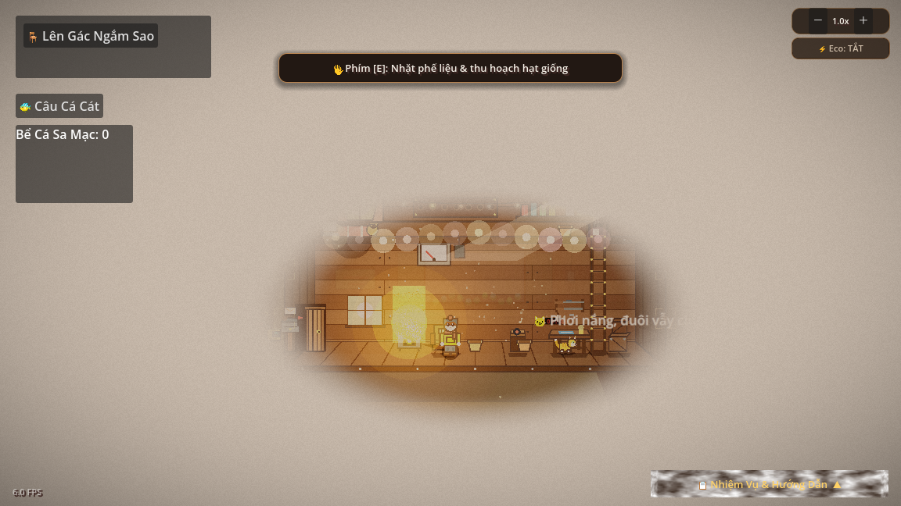
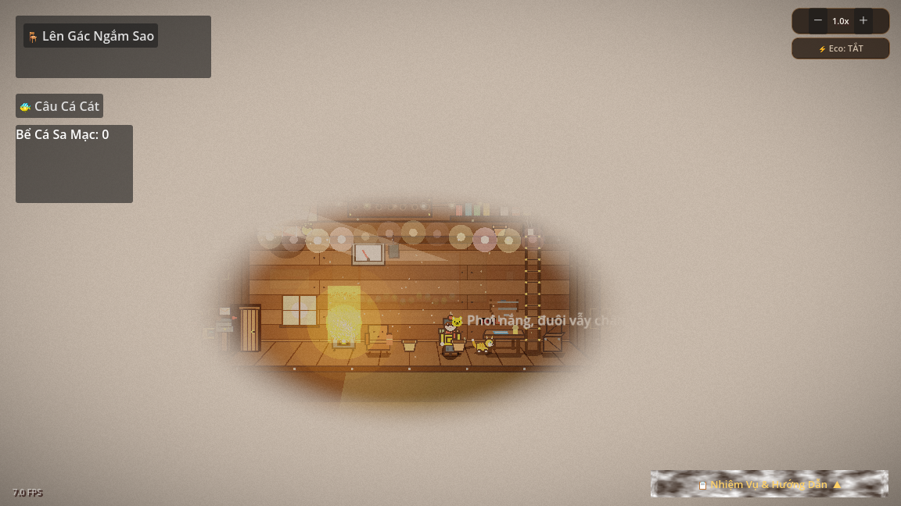
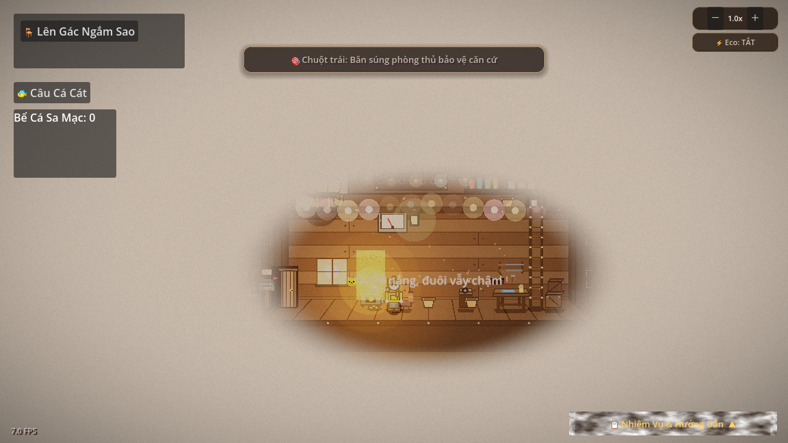
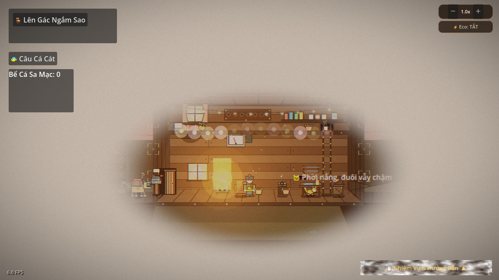
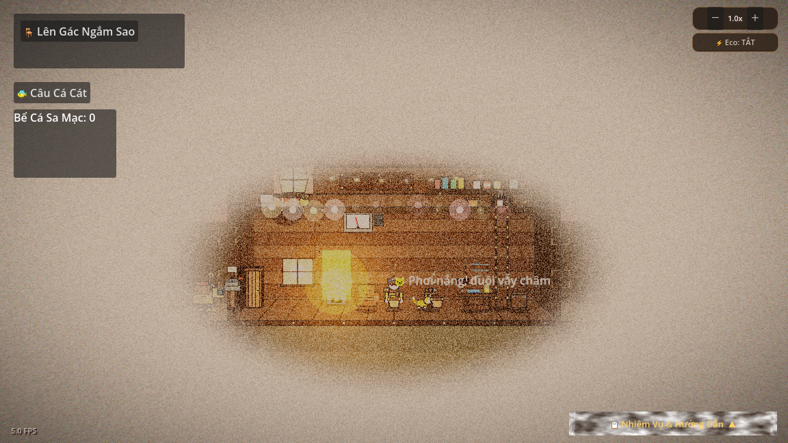
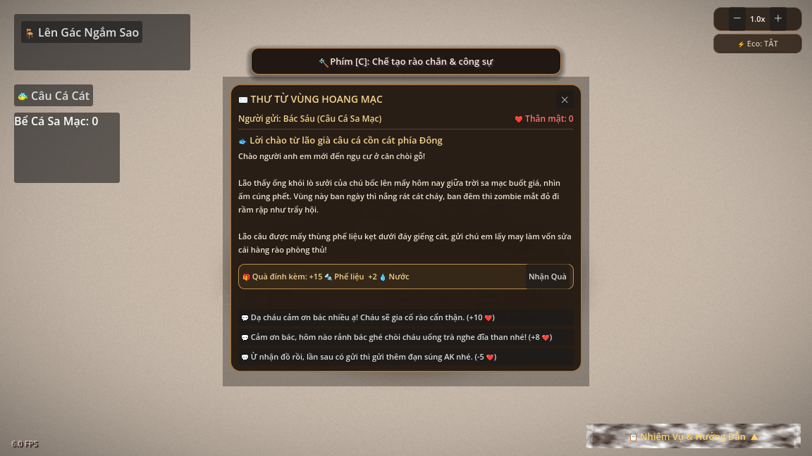
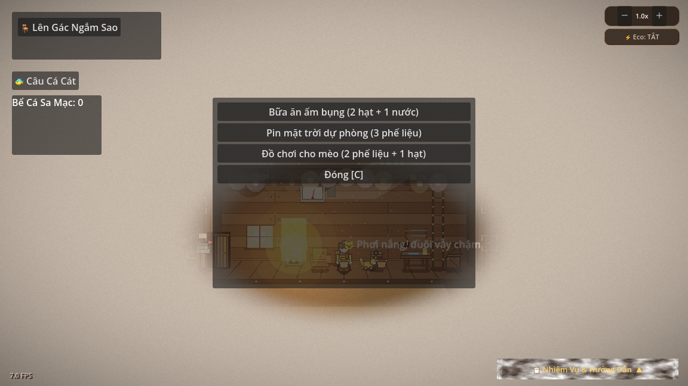

# Showcase Gallery: Insomnia in the Dark War (Bản Cập Nhật Mới Nhất)

Bộ tài liệu tổng hợp hình ảnh thực tế được trích xuất trực tiếp từ Viewport của game **Insomnia in the Dark War**, thể hiện đầy đủ chu kỳ thời gian (ngày/hoàng hôn/đêm), các trạng thái thời tiết đặc trưng và các tính năng giao diện (UI) cốt lõi mới nhất — bao gồm hệ thống **Cinematic Contrast (Vùng bảo vệ tâm bão Radial Clarity Mask, Beacon Lighting lò sưởi, Multi-layer Parallax Weather, Chế độ Eco tối ưu)** vừa được nâng cấp.

---

## 1. Ngày Nắng Đẹp Bình Thường (Clear Day)

* **Vị trí ảnh trong repo:** [`docs/screenshots/clear_day.png`](docs/screenshots/clear_day.png)
* **Mood & Gameplay:** Ánh ban ngày ấm áp rọi qua ô cửa sổ áp mái tạo nên các vệt sáng God-rays đặc trưng kết hợp với bụi nắng lơ lửng và dải đèn đom đóm rực rỡ trong cabin. Góc trên bên phải hiển thị cụm điều khiển Zoom camera và nút bật/tắt chế độ Tiết kiệm điện (Eco Mode). Bé mèo đồng hành nằm thảnh thơi sưởi nắng, mang lại trải nghiệm sinh tồn lofi ấm cúng, thư thái.

---

## 2. Hoàng Hôn Chiều Tà (Sunset - Ánh Nắng Xiên)

* **Vị trí ảnh trong repo:** [`docs/screenshots/sunset.png`](docs/screenshots/sunset.png)
* **Mood & Gameplay:** Bầu trời chuyển sang gam màu cam hồng rực rỡ của "Golden Hour" với các tia nắng xiên góc dài quét qua toàn bộ căn nhà gỗ. Khoảnh khắc vừa thơ mộng vừa báo hiệu sự chuyển giao căng thẳng, thôi thúc người chơi hoàn tất các công việc ngoài trời để kịp rút lui về chòi trước khi hoàng hôn tắt hẳn.

---

## 3. Đêm Tối & Lửa Trại Sưởi Ấm (Night Campfire)

* **Vị trí ảnh trong repo:** [`docs/screenshots/night_campfire.png`](docs/screenshots/night_campfire.png)
* **Mood & Gameplay:** Màn đêm xanh thẫm bao trùm sa mạc lạnh lẽo dưới bầu trời ngàn sao lấp lánh, đối lập với ánh lửa trại bập bùng tỏa nhiệt lượng vàng ấm từ lò gang (`Stove`) cải tiến và dải đèn đom đóm trong nhà. Sự tương phản giữa hiểm nguy tăm tối rình rập ngoài hàng rào và sự ấm cúng, an yên bên bếp lửa chính là linh hồn trải nghiệm của Insomnia.

---

## 4. Thời Tiết Trời Mưa (Rain)

* **Vị trí ảnh trong repo:** [`docs/screenshots/rain.png`](docs/screenshots/rain.png)
* **Mood & Gameplay:** Hệ thống thời tiết đa tầng (Parallax Weather 3 lớp: near, mid, far) với góc rơi chéo chân thực, kết hợp hiệu ứng chớp tím và sấm sét rền vang. Công nghệ **Radial Clarity Mask** tự động khoét vùng sáng trong suốt quanh cabin, giữ cho nơi trú ẩn luôn an toàn và sáng rõ giữa cơn mưa rào hậu tận thế.

---

## 5. Thời Tiết Bão Cát (Sandstorm)

* **Vị trí ảnh trong repo:** [`docs/screenshots/sandstorm.png`](docs/screenshots/sandstorm.png)
* **Mood & Gameplay:** Cơn bão cát sa mạc gầm rú với hàng trăm vệt cát cuộn xoáy với tốc độ cao, phủ một lớp Haze bụi vàng đặc trưng lên không gian bên ngoài. Hiệu ứng **Beacon Lighting** tự động đẩy độ sáng của lò sưởi gang lên 1.4x và nhấp nháy theo nhịp thở sinh tồn, tạo sự tương phản điện ảnh tuyệt đối giữa hiểm họa bên ngoài và sự che chở bên trong cabin.

---

## 6. Tính Năng Giao Diện: Hòm Thư Phương Xa (Mailbox UI)

* **Vị trí ảnh trong repo:** [`docs/screenshots/mailbox.png`](docs/screenshots/mailbox.png)
* **Mood & Gameplay:** Giao diện gỗ mộc mạc hiển thị các bức thư truyền tin từ những người bạn lang bạt (như Bác Sáu câu cá cát), đi kèm gói quà tiếp tế hữu ích và các lựa chọn hồi đáp đa dạng có ảnh hưởng trực tiếp đến điểm thân mật. Tính năng này mang lại sợi dây gắn kết nhân văn và sự ấm lòng giữa thế giới hoang tàn cô quạnh.

---

## 7. Tính Năng Giao Diện: Bảng Chế Tạo (Crafting UI)

* **Vị trí ảnh trong repo:** [`docs/screenshots/crafting.png`](docs/screenshots/crafting.png)
* **Mood & Gameplay:** Bảng công thức chế tạo nhanh với giao diện tối giản, trực quan giúp người sống sót dễ dàng phối hợp phế liệu, hạt giống và nước để nấu bữa ăn nóng xua tan mệt mỏi, chế tạo pin dự phòng hay làm đồ chơi cho mèo. Đây là mắt xích thiết yếu để người chơi quản lý tài nguyên và duy trì nhịp độ sinh tồn ổn định.
